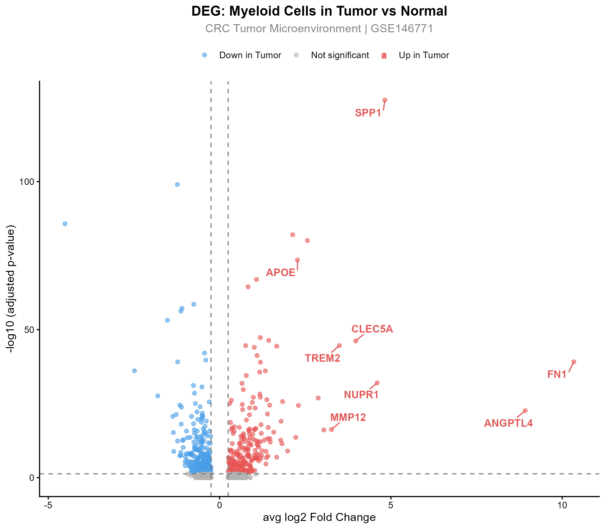
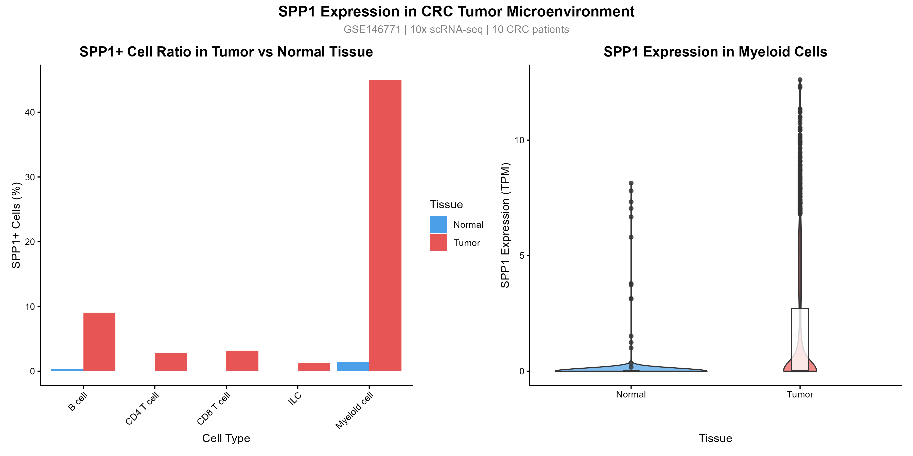
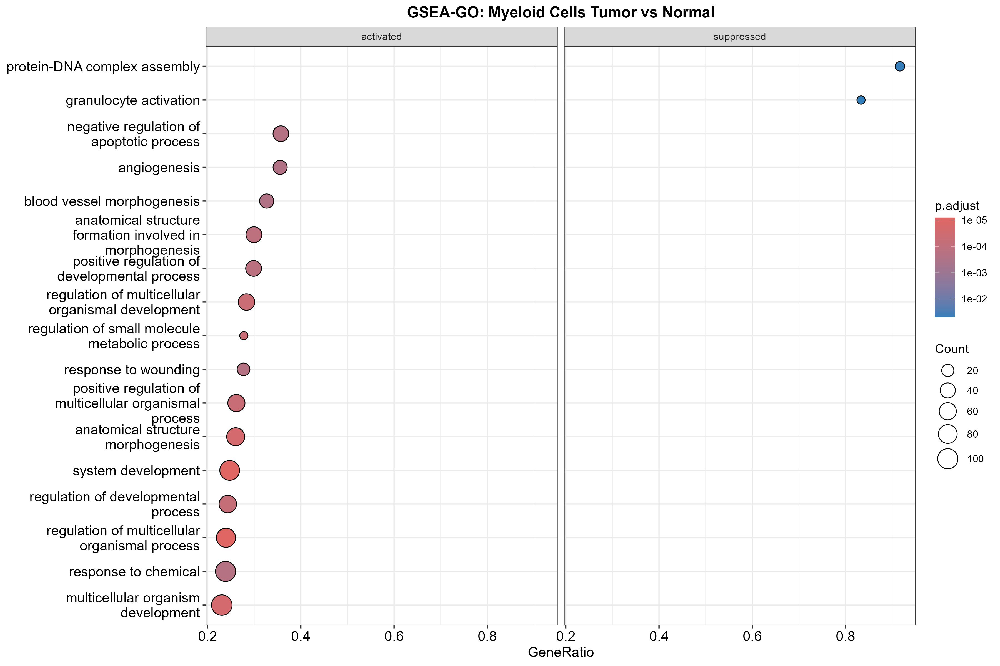
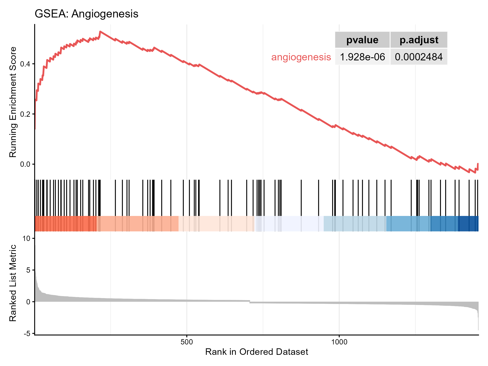

# SPP1+ Macrophage Enrichment in Colorectal Cancer Tumor Microenvironment

A single-cell RNA-seq analysis of immune cells in colorectal cancer (CRC), using publicly available data from GEO (GSE146771). Starting from unbiased differential expression analysis, SPP1 was identified as the top upregulated gene in tumor-associated myeloid cells, followed by functional enrichment analysis revealing pro-tumorigenic pathway activation.

---

## Dataset

| Item | Detail |
|------|--------|
| GEO Accession | [GSE146771](https://www.ncbi.nlm.nih.gov/geo/query/acc.cgi?acc=GSE146771) |
| Platform | 10x Chromium |
| Samples | 10 CRC patients |
| Total Cells | 43,817 leukocytes |
| Tissue Types | Tumor (T), Normal (N), Peripheral Blood (P) |
| Cell Types | B cell, CD4 T cell, CD8 T cell, Myeloid cell, ILC |

---

## Analysis Strategy

This analysis follows a **data-driven approach** — SPP1 was not pre-selected as a target. Instead, unbiased DEG analysis was performed first, and SPP1 emerged naturally as one of the top upregulated genes in tumor myeloid cells.

```
Unbiased DEG Analysis (Tumor vs Normal Myeloid Cells)
        ↓
SPP1 identified as top upregulated gene (log2FC = 4.82)
        ↓
SPP1+ cell enrichment quantified across all cell types
        ↓
GSEA reveals pro-tumorigenic pathway activation
```

---

## Key Findings

### 1. SPP1 is significantly upregulated in tumor myeloid cells

| Gene | log2FC | p.adjust | pct.Tumor | pct.Normal |
|------|--------|----------|-----------|------------|
| FN1 | 10.34 | 7.1e-40 | - | - |
| ANGPTL4 | 8.92 | 2.2e-23 | - | - |
| **SPP1** | **4.82** | **3.1e-128** | **0.45** | **0.015** |
| TREM2 | 3.50 | 2.5e-45 | - | - |
| MMP12 | 3.27 | 5.3e-17 | - | - |

### 2. SPP1+ myeloid cells are dramatically enriched in tumor tissue

| Tissue | Cell Type | Total Cells | SPP1+ Cells | SPP1+ Ratio |
|--------|-----------|-------------|-------------|-------------|
| Normal | Myeloid cell | 1,025 | 15 | 1.46% |
| **Tumor** | **Myeloid cell** | **2,559** | **1,152** | **45.0%** |

> **~30-fold enrichment of SPP1+ macrophages in tumor vs normal tissue**

### 3. Tumor myeloid cells activate pro-tumorigenic pathways

GSEA-GO analysis revealed significant activation of:
- **Angiogenesis** (p=1.9×10⁻⁶) — consistent with ANGPTL4 upregulation
- **Negative regulation of apoptotic process** — tumor cell survival
- **Response to wounding** — ECM remodeling, consistent with FN1/MMP12 upregulation

---

## Visualizations

### DEG Volcano Plot


SPP1 appears as one of the most significantly upregulated genes in tumor myeloid cells.

### SPP1 Expression Analysis


Left: SPP1+ cell ratio across immune cell types. Right: SPP1 expression distribution in myeloid cells.

### GSEA Pathway Analysis


### Angiogenesis Enrichment Curve


---

## Analysis Pipeline

```
Raw Data (GEO GSE146771)
        ↓
00_setup.R              — Environment setup
        ↓
01_load_data.R          — Load and inspect metadata
        ↓
02_load_expression.R    — Load expression matrix
        ↓
03_seurat_object.R      — Create Seurat object
        ↓
04_SPP1_analysis.R      — SPP1 cell ratio analysis
        ↓
05_visualization.R      — SPP1 expression plots
        ↓
06_DEG_analysis.R       — Differential expression analysis
        ↓
07_volcano_plot.R       — Volcano plot visualization
        ↓
08_GSEA_analysis.R      — Gene set enrichment analysis
```

---

## Requirements

```r
# R version 4.5+
library(Seurat)
library(tidyverse)
library(ggplot2)
library(patchwork)
library(harmony)
library(clusterProfiler)
library(org.Hs.eg.db)
library(enrichplot)
library(ggrepel)
```

---

## Biological Interpretation

The enrichment of SPP1+ macrophages in CRC tumor microenvironment, combined with activation of angiogenesis and ECM remodeling pathways, suggests:

- **Functional reprogramming**: Tumor-associated macrophages shift toward a pro-tumorigenic phenotype
- **Immunosuppression**: SPP1+TREM2+ macrophage co-enrichment indicates immune suppression
- **ECM remodeling**: FN1, MMP12 upregulation promotes tumor invasion
- **Therapeutic implication**: SPP1+ TAMs may represent a potential target for improving immunotherapy response in CRC

---

## Author

**Xin Liu**
Molecular Biology Researcher | Bioinformatics | Medical AI
GitHub: [xinliu756](https://github.com/xinliu756)

---

## Data Source

GSE146771 — Single-cell transcriptomic landscape of colorectal cancer
